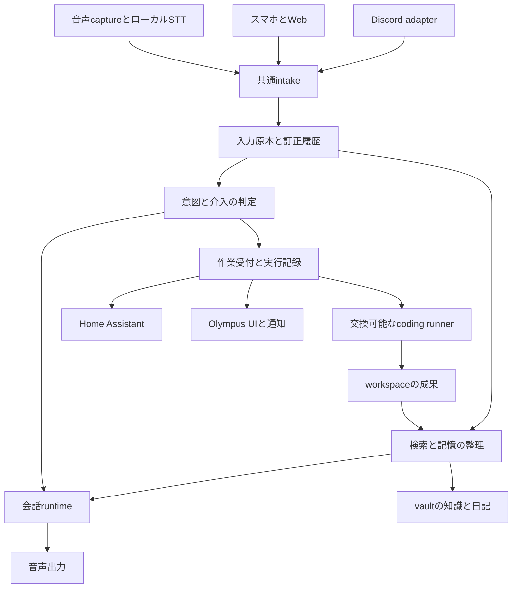

# Life OSの統合設計と技術調査

保存形式とvault構成の推奨は、[Life OSの保存形式とTimesの再設計](vault-data-model-2026-09-14.md)で更新した。直接ファイル編集を必要としない条件に基づき、DB正本・添付ファイル・Markdown exportを推奨する。以下の既存構成維持案は初回調査時点の判断として読む。

## 2026-09-14の要件更新

以下は初回調査後に確認された設計条件であり、本文の未確認事項より優先する。本文の公開仕様とコード調査は2026-09-09時点の記録として維持し、今回再検証したものとはしない。

| 項目           | 確認された条件                                 | 設計への反映                                                                      |
| -------------- | ---------------------------------------------- | --------------------------------------------------------------------------------- |
| 音声系の保存先 | Home Assistant repository                      | Home Assistant repository側のdocs/16-open-homepod-vision.mdを製品構想の正本にする |
| 中央サーバー   | Ryzen 5 PRO・RAM 16GB・storage 1TBの自宅ミニPC | 正確なCPU型番・GPU・空き容量・音声性能は未測定                                    |
| クラウド       | 個人情報を除く処理は許容方向                   | 除外する情報の分類と送信粒度は未決                                                |
| 圏外           | 初期要件に含めない                             | offline編集・同期・outboxを必須にしない                                           |
| 人間による編集 | UIまたはCLI wrapper経由                        | Markdown直接編集との互換性を必須にしない                                          |
| Orca           | 現在利用しているOrca / Orca CLI                | 対象の特定は完了。runner/handoff互換性は別途検証                                  |

音声構想はHomePodを最終rendererとし、Linux側のmedia・会話処理と外付けmicを組み合わせる。詳細とPhase 0以降の計画はHome Assistant側に集約し、Life OS側では入力event・記憶参照・作業受付・成果通知の接続だけを扱う。

編集がUI/CLI経由に限定されたため、Markdown正本は必須条件ではなくなった。既存Markdownを維持する案と、event・intent・taskのDB正本にMarkdown exportを組み合わせる案を再比較する。既存Olympusの保存方式を変更する判断はまだ行っていない。

オンライン前提でも通常のtimeout・再送・途中停止の整合性は必要になる。一方で圏外時の全文閲覧や編集競合解消のための仕組みは初期scopeから外す。16GBでSTTと大きなLLMを同時常駐できるとは仮定せず、音声処理を実測して推論の配置を決める。

新しい音声構想のwake→duckと、先行要件のwake前の発言記憶は別経路として接続する案を残す。クラウドへ送らない情報の具体的な境界、音声保持、能動発話、自動着手、予算は引き続き未決である。

## 1. 推奨する方向

Life OSの中心は、日常の入力を保存し、その根拠を取り出し、現在の意図に照らして必要な作業を進める循環に置く。音声会話、ノート、家電操作、開発環境は、この循環に参加する異なる機能である。すべてを同じrepositoryやLLM sessionへまとめる必要はない。

推奨案は、Olympusを生活上の記録・判断・タスクの中心として育て、音声runtime、外部agent runner、Home Assistant、vaultの人間向け文書を明確な契約で接続する構成である。まずDiscordとスマホのテキスト入力で保存から検索までを成立させ、常時音声を同じ入口へ追加する。既存のvaultを全面移行する前に、入力の識別、原本の保持、状態の所有者、訂正、再送を決める。

この提案は2026年9月9日時点の公開一次資料とローカルの設計・コードを基にする。ローカルコードの存在と本番での稼働は区別する。音声認識性能、運用費、実際のaccount切り替え互換性は未測定であり、製品の宣伝上の性能値を採用根拠にはしていない。

成果の基準は次の五つとする。

- 入口が変わっても同じ出来事を一度だけ記録できる
- 過去の発言を出典付きで取り出せる
- 発言とAIの推測と実行許可を区別できる
- 会話やモデルが切り替わっても依頼と成果が残る
- 品質を維持したまま不要なLLM呼び出しを減らせる

## 2. 既存資産と現在のずれ

### 2.1 確認できた構成

| 資産           | 確認した内容                                                                       | 活かす責務                       | 確認の限界                                               |
| -------------- | ---------------------------------------------------------------------------------- | -------------------------------- | -------------------------------------------------------- |
| dotfiles       | Nixによる環境配布・account profile・session handoff・複数repo workspace            | ツールと配置と運用設定           | 現在のサーバー適用状態は未確認                           |
| vault          | Daily・Knowledge・Projects・AI観測領域とTimes運用文書                              | 人が読み訂正できる知識と成果     | 個人の日記本文全体は調査対象外                           |
| vault-agi      | Discord/Web GatewayとMaster構成。VaultWriterがDailyへTimesを追記                   | Discord入力adapterの移行元       | 全機能の稼働確認は未実施                                 |
| Olympus        | Times・intakeのREST route。投稿ID・client・audio参照。SQLite indexとLLM job worker | 生活データとUIとdomain operation | driverは設定情報を返す薄い実装であり完全なrunnerではない |
| Home Assistant | HA/ESPHomeと機器操作・routineの構成文書                                            | 家電状態と機器操作               | 音声会話runtimeは未実装と明記                            |
| VoiceOS設計    | 音響・会話・capability・job supervisor・runnerの境界                               | 音声接続の設計素材               | 常時保存とは異なる保存方針を含む                         |
| flux-voice     | 発話からGuide/Scout/議事録へ進む構想と介入頻度のUI                                 | 壁打ち体験の比較素材             | README確認のみ。現行動作は未検証                         |

ローカル根拠は付録Aにrepository名と相対パスで記載する。API routeの登録とworker起動箇所まで確認したが、実サーバーに接続したend-to-end確認ではない。

### 2.2 統合前に解消すべき不一致

OlympusのarchitectureにはTimes、LLM、queueが未実装と書かれた節があるが、対応するコードとgatewayへの登録が存在する。一方、`driver/index.ts`はenabledとendpointを返すだけで、sessionの開始・再開・取消を実装していない。文書上の全体構想を、そのまま完成度の説明に使うことはできない。

Home AssistantのVoiceOS文書はOlympusをtask中心の任意接続先として扱う。Olympus自身のarchitectureはTimesを入口とするLife OSへ責務を広げている。両方が会話履歴とjob状態の正本を持つと二重管理になる。これはrepo統合より先に決める必要がある。

vaultのAGENTSとCLAUDEにはタスク管理先の不一致がある。Times運用文書にも実装済みの説明と次段階の一覧が一致しない箇所がある。古い文書が検索で取得されると、モデルの能力とは無関係に誤った操作先を選び得る。現行・廃止・提案を機械的に絞り込めるmetadataが必要である。

既存VoiceOSは録音とtranscript保存を既定無効としている。常時記録を目指す新しい要件では、保存方針を意識的に変更する必要がある。この調査では既存設定を変更していない。

### 2.3 Discord依存の正確な範囲

「Discordしか入口がない」という状態からは、Olympus側が既に一歩進んでいる。`/api/intake`と`/api/times`があり、`client`で入口を区別できる。Times投稿には`voice`と`audio_id`もある。ただし音声全体の常時認識や受信原本の永続化が完成していることは意味しない。

vault-agiのVaultWriterは`10_Daily`内のTimes見出しへ直接追記する。process内のwrite queueはあるが、確認した入力型には汎用のsource event IDがない。Olympus側のmutation receiptとは別経路である。新しい入口を増やす前に、Discord投稿を共通intakeへ渡し、Dailyをその表示・集約先にする移行が有効と考える。

Olympusのmutation receiptも完全な重複排除保証としては扱えない。確認したrouteではMarkdown保存、index更新、job登録の後にreceiptを保存する。途中停止や並行再送を含む保証は追加検証が必要であり、「mutation IDがあるのでexactly-once」とは結論しない。

## 3. 近い前例と使える部分

### 3.1 生活の入力と実行をつなぐ製品

| 候補           | 一次資料で確認した機能                                         | この構想との関係                     | 採用判断                               |
| -------------- | -------------------------------------------------------------- | ------------------------------------ | -------------------------------------- |
| Omi            | wearable・desktop・mobileからbackendへ入力。音声処理と会話活用 | 常時入力から生活記憶を作る体験が近い | 入力体験とデータ構造を参考にする       |
| Screenpipe     | ローカルの画面履歴・音声認識・検索用の記録                     | 音声以外の生活・作業文脈を追加できる | PC観測adapterの将来候補                |
| OpenClaw       | 多数のchannelをGatewayへ集約。typed WebSocketとnode接続        | 多入口の個人agentとして近い          | Gateway全体採用とadapter利用を比較する |
| Home Assistant | ローカルSTT/TTSを組み合わせるAssist                            | 家電と定型操作の既存基盤             | 家電の正本として維持                   |
| Orca           | 複数coding CLI・worktree・remote・mobile・account切り替え      | 開発の実行と人間の監督に近い         | runner側の評価候補                     |

Omiの公開構成図にはDeepgram、Firestore、Redis、LLMが含まれる。open sourceであることは、標準構成が完全ローカルであることを意味しない。自宅での連続音声処理をそのまま満たす前提では採用しない。[^1]

ScreenpipeはPC上の活動を文脈として取り出す候補になる。現在のREADMEには変更イベントに応じた画面取得とローカルWhisperによる音声処理が記載されている。部屋の音声会話とPC観測は異なる入力であり、導入するなら別adapterとして扱う。[^2]

OpenClawは複数channelを単一Gatewayへ集約し、nodeのcapabilityを接続する構成を公開している。ただしGatewayの通知eventは再送されず、欠落時にclientが状態を再取得する設計である。これを耐久的な出来事台帳の代わりにはしない。[^3]

比較した製品は構想の一部分を満たす。公開資料だけでは、日本語の自宅環境で常時記憶・適切な介入・異種account引き継ぎ・既存vault整合性まで一体で保証する構成は確認できない。「前例がない」と断定するのではなく、組み合わせと実測が必要な範囲が残ると判断する。

### 3.2 音声会話基盤

| 候補              | 強み                                               | Life OS側で別途持つもの           | 判断                                       |
| ----------------- | -------------------------------------------------- | --------------------------------- | ------------------------------------------ |
| LiveKit Agents    | turn detection・割り込み・会話sessionの基盤        | 常時記録・長期記憶・介入方針・job | スマホを含む会話実験の第一候補             |
| Pipecat           | Pythonの音声pipelineと多数のprovider接続           | 同上                              | ローカル音声処理を細かく組む場合の比較候補 |
| ElevenLabs Agents | 会話flow・無音待ち・割り込み・応答タイミングの設定 | provider外の原本と作業状態        | 体験を早期比較する候補                     |
| OpenAI Realtime   | 音声対音声・VAD・server側tool制御                  | sessionを超える記憶と介入判断     | 自然な会話の比較対象                       |
| HA Assist         | 機器制御に結びついた音声pipeline                   | 自由会話の記憶と長時間作業        | 家電用途で継続                             |

LiveKitのturn detectionはVADだけでなく意味や音響による終話判断を扱う。PipecatはSTT、TTS、transport等を組み合わせるPython frameworkである。どちらもLife OSの記憶正本や意図の有効期限を自動で定義するものではない。[^4][^5]

ElevenLabsはturn eagerness、interruptions、soft timeout等の設定を持つ。声の品質と会話の自然さを比較する価値はあるが、沈黙に対する応答設定を「困っている状況の正しい理解」と同一視しない。[^6]

OpenAI Realtimeの公開仕様にはVADによる自動返答の制御とWebRTC/SIPのsideband接続がある。発話区切りの検出と、返答を実際に生成する判断を分ける構成が可能である。[^7][^8]

公開仕様上、Realtime sessionには60分の上限がある。継続した生活記憶を一つのsessionへ置く設計は採れない。session更新時に必要な文脈を注入するLife OS側の仕組みが必要になる。ChatGPTの音声UIの内部構造を再現できるという意味ではない。[^9]

### 3.3 記憶基盤

| 候補                       | 何を提供するか                                     | 適した実験                         | 留意点                                    |
| -------------------------- | -------------------------------------------------- | ---------------------------------- | ----------------------------------------- |
| Basic Memory               | Markdownを使ったAI向け記憶と検索。SQLiteを利用可能 | 既存Knowledgeの小規模接続          | Olympusと同じnoteを複数writerで管理しない |
| Mem0                       | 会話からLLMで記憶を抽出して検索へつなぐ            | 少量の発言から観測候補を生成       | 抽出時のLLM費と誤認を測る                 |
| Graphiti                   | 時間変化と出典episodeを持つgraph                   | 訂正・人物・プロジェクト関係の検索 | entity統合精度と運用負担の検証が必要      |
| Letta                      | 持続するagent状態と記憶を管理する設計              | stateful agentの比較               | 既存harnessとの責務重複を確認             |
| SQLiteと独自の小さなschema | 原本参照・検索・訂正・queueを限定実装              | 現行Olympusに沿ったbaseline        | 記憶の意味づけは別途設計が必要            |

Basic MemoryはMarkdownと複数AI clientをつなぐ候補であり、vaultの構造が根本的にAIと相性が悪いという見方への反例になる。Mem0は通常の記憶追加にLLM抽出を用いる。Graphitiはfactの時間的な有効性と原本episodeへの参照を扱う。機能が異なるため、三つを同時導入する理由にはならない。[^10][^11][^12]

Lettaの確認したstateful agents解説はV1 SDKのlegacy領域である。memory blockや保存messageの考え方を比較対象とし、現行SDKの採用手順や互換性は別途確認する。[^13]

OpenClawのmemory資料も、記憶に許可の背景を書いておくことと、実際のpolicy強制を区別している。Life OSでも記憶された文章をそのまま実行権限にしない設計が妥当である。[^14]

## 4. 統合する責務と分離する責務

### 4.1 三つの選択肢

| 案                     | 利点                                     | 代償                                      | 適する条件                       |
| ---------------------- | ---------------------------------------- | ----------------------------------------- | -------------------------------- |
| Olympusを中心に育てる  | Times・UI・task・indexを再利用できる     | 音声とrunnerとの境界を整える必要          | 現在の成果を維持したい           |
| OpenClawを中心にする   | channelとagent運用を既製基盤へ寄せやすい | Olympusとのsession・memory・scheduler重複 | 統合機能の自作を減らす方が重要   |
| 独立した新Life OS core | 境界を新たに定義しやすい                 | 第三のGatewayと移行作業が増える           | 既存coreの再利用困難が実証された |

現時点では第一案を推奨する。理由は既存コードに汎用intake、Times ID、検索、jobの一部があり、第三の中枢を作る前にその境界を整理できるからである。OpenClawの全体採用は、channel追加と運用の比較実験で明確に有利な場合に再評価する。

### 4.2 推奨する論理構成



この図は論理モジュールであり、全箱を別serviceにする提案ではない。最初はOlympusのcontrol processと既存core、独立audio process、外部runnerで足りるかを検証する。音声frameworkがPythonを要求する場合も、生活domainの全面書き直しは不要である。

| 領域                 | 正本の所有者            | 接続先が持つもの            |
| -------------------- | ----------------------- | --------------------------- |
| 受信した出来事       | intakeの永続記録        | event IDと取得用参照        |
| 文字起こし           | transcript store        | revision付き本文            |
| 確認済みの知識       | vault/Olympusの文書領域 | 検索index                   |
| 推定した好みや意図   | 観測・判断領域          | 根拠と確度と有効期限        |
| taskとproject        | Olympus                 | IDと表示用snapshot          |
| jobの依頼と結果      | 一つの作業受付module    | 音声とWebは表示・操作client |
| coding processの状態 | runner supervisor       | job IDとnative session参照  |
| 音声turnと再生位置   | 会話・audio runtime     | 永続記録への参照            |
| 家電状態             | Home Assistant          | 取得時刻付きsnapshot        |
| toolの版と配置       | dotfiles                | 各runtimeの設定             |

jobの受付状態とprocessの状態は同じではない。runnerが停止しても「何を頼まれたか」は残り、runnerから再開・失敗・不明を照合できるようにする。

repoをまとめる単位はLife OS用workspaceが適する。既存の複数repo workspace機能で目的、責務表、契約、検証シナリオを共有できる。repoごとの履歴は維持し、同時変更が頻発する小さな契約だけ後から共有packageへ抽出する。今回はworkspaceの新設は行っていない。

## 5. vaultと保存方法

### 5.1 Markdownに適するもの

日記、設計、知識、振り返り、確定した意思決定はMarkdownで扱える。人間が読めること、Obsidianで修正できること、他harnessへ移しやすいことはLife OSの長期運用に有利である。

一方、音声frame、細かいASR更新、queue lease、再試行回数を人間用Dailyへ直接追加すると、読みやすさと並行更新の両方を損なう。ファイル形式の良し悪しより、データの頻度、更新の仕方、訂正、復旧要件で分けるべきである。

| データ                         | 初期案                         | 復旧の扱い                           |
| ------------------------------ | ------------------------------ | ------------------------------------ |
| 音声原本                       | privateなblob領域に分割保存    | 保持方針に従ってbackupまたは期限削除 |
| 入力eventとtranscript revision | 永続SQLiteまたは追記可能な記録 | 消してよいcacheにはしない            |
| 日記・知識・設計               | 現行Markdown                   | 版管理とbackup                       |
| task/project                   | 現行Olympus Markdown           | 既存契約を維持                       |
| 全文検索・embedding            | 再生成できるindex              | 原本revisionから再構築               |
| queue・実行receipt・通知状態   | 運用SQLite                     | 独立してbackupと復旧                 |

上記のevent保存は現行Olympusからの変更提案である。全domain dataをMarkdown正本とする現在の設計を黙って変更しない。volumeと障害実験を経て、eventだけDB正本にするか、追記ログを正本にしてDBを派生物にするかをADRで確定する。新たにDBを使う場合も、JSONL等へexportできることを受入条件にする。

### 5.2 最小のデータ契約

```text
InputEvent
  id, schema_version, source, source_event_id
  occurred_at, received_at, actor_id, device_id
  kind, content_ref, revision, replaces_event_id

Observation
  id, subject, claim, source_refs
  status: hypothesis | confirmed | superseded
  observed_at, valid_from, valid_until, confidence

Intent
  id, source_refs, desired_outcome
  status: candidate | active | paused | completed | abandoned
  constraints, review_at, authorization_ref

WorkRequest
  id, intent_id, scope, acceptance_criteria
  deadline, budget, context_manifest, runner_capabilities

Artifact
  id, work_request_id, location, revision
  verification, created_at
```

これは確定APIではなく、失いたくない意味の一覧である。初回から全fieldを必須化しない。特にactorの本人確認済み状態と、声から推定した話者を同じ値にしない。

STTのraw textと読みやすく整形したtextは分ける。「やりたい」と「やりたくない」の修正がtask判断を変えるためである。整形済みDailyだけが残る構成では、元の発言を検証できなくなる。

保存原本は通常の編集で上書きしない一方、削除要求は実現できるようにする。削除対象から派生したindex、要約、観測を追跡する。取り消した意図が古い要約から復活しないよう、検索時にもsuperseded状態を判定する。

### 5.3 複数デバイスとクラウド

初期案はhomelabを一つの書き込み中心として、スマホとMacをAPI clientにする。スマホには未送信入力のoutboxを持ち、同じsource event IDで再送する。自宅外アクセスは既存のprivate接続方式を活かすかを確認する。

オフラインで全文編集したい場合は別の要件になる。revによる競合表示または共同編集機構が必要であり、単なるファイル同期ではdomain上の競合を解決できない。稼働中のSQLiteを端末間で直接同期する設計も避け、APIと整合したbackupを使う。

クラウド閲覧、クラウドbackup、クラウド推論は別々に選択できる。どれか一つが必要だからすべてをクラウドへ移す理由にはならない。サーバー停止時にも閲覧を続けたい場合は、read replicaや直近成果の端末cacheを追加する価値がある。

## 6. 常時音声と自然な会話

### 6.1 二つの経路

常時記録は、capture、音響処理、VAD、STT、時刻付き保存へ進む経路とする。会話は、その一部の発話と取り出した記憶を使い、今返答するかを判断する経路とする。録音が継続していることと、LLMが24時間すべての音声へ返答することを分ける。

「さっきの話を覚えている」を成立させるには、wake wordより前の発言が保存・検索対象になっている必要がある。wake wordを必須にしなくても、発話がagentに向けられているかを決める機能は必要になる。

| 判定           | 分かること                 | 分からないこと       |
| -------------- | -------------------------- | -------------------- |
| VAD            | 発話らしい音の区間         | 誰への発話か         |
| STT            | 音から得た文字列           | 実行してよいか       |
| 話者分離       | 声が同じか異なるかの推定   | 本人認証の保証       |
| turn detection | 話が一区切りか             | 口を挟んでほしいか   |
| 呼びかけ判定   | agent宛てかの推定          | 長期的な意思の確定   |
| 介入policy     | 返答・提案・記録だけの選択 | 観測できない心の状態 |

### 6.2 ローカルSTTの実現性

whisper.cppにはCPU、Apple Silicon、GPUの実行経路とマイク入力の例があるため、ローカルSTT自体は具体的な実装候補を持つ。ただしstream exampleはnaive exampleとされており、そのまま高品質な常時ASR serviceとみなさない。[^15]

Home AssistantのSpeech-to-Phraseはclosed-endedで、家電の定型命令向けである。自由な日本語の独り言や設計相談にはWhisper等のopen-ended認識が必要になる。公式の処理時間例を本人のマイク・日本語・同居環境へ直接適用しない。[^16]

最初に確認するのは、近距離の声、遠距離の声、音楽再生中、長い言いよどみ、英語の固有名詞、日本語の否定、複数人の会話である。実時間係数は処理時間÷音声時間で計算し、1未満でも混雑時のbacklogと対話遅延を別に見る。無音を認識した際の不要な文字列生成も測定する。

音声の生PCMが16kHz・16bit・monoなら、一日分は約2.76GBである。計算は16000×2×86400 byteであり、30日で約82.9GBになる。仮に24kbpsで連続圧縮すれば約259MB/日だが、codec、container、backup、複数channelで変わる。VADで無音を捨てると意味のある発話を取りこぼす可能性があるため、短いpre-rollを含めて評価する。

### 6.3 体験上の難所

最大の難所は、話していない音声を認識しないこと、agent自身のスピーカー音を再入力しないこと、話を途中で遮らないこと、話しかけられた時には遅れないことである。遠隔speakerとmicを組み合わせる場合、AECに必要な再生参照と遅延の扱いが成立するかを確認する。

音声会話を止めても調査jobは継続できる必要がある。「ちょっと黙って」と「その開発を中止して」を別操作として扱う。割り込み時には生成停止だけでなく出力bufferを止め、実際に聞こえた応答範囲を管理する。LiveKitの公開仕様もこの会話履歴の切り戻しを扱う。[^4]

provider差し替えは共通の`respond`関数だけでは足りない。audio形式、partial/final、barge-in、聞こえた範囲、tool待ち、切断、session上限、text注入可否をcapabilityとして表す。音声対音声とSTT→LLM→TTSは別実装として扱い、必要な体験が共通する範囲だけを契約にする。

## 7. 記憶と能動性

### 7.1 記憶は四つに分ける

episodeは「いつ何と言ったか」、semantic memoryは「現在何を知っているか」、intentは「何を実現したいか」、working contextは「今の会話と作業に何が必要か」である。同じ発言から作られても更新と寿命が異なる。

例えば「いつか部屋の音声agentを作りたい」は原本として保存し、意図候補にもできる。しかし、その時点でhardware購入や開発開始の許可があるとは限らない。後日「今月は保留」と言えば意図はpausedへ変わり、原発言は過去の根拠として残る。

訂正は新しいfactを追加するだけでなく、旧factの検索上の有効性を変える。LongMemEvalは情報抽出、複数sessionにまたがる推論、時間推論、知識更新、回答を控える能力を評価している。この分け方を本人の評価セットへ取り入れる価値がある。[^17]

### 7.2 介入を段階化する

| 段階 | 行動                                 | 初期の扱い               |
| ---- | ------------------------------------ | ------------------------ |
| 0    | 記録して検索可能にする               | 常時記録の基本           |
| 1    | 関連情報を裏で用意する               | 明示された予算内で実験   |
| 2    | 静かなUIに提案を出す                 | 採用・却下を観測         |
| 3    | 声で話しかける                       | 状況と頻度を測定して追加 |
| 4    | taskやローカル作業を開始する         | 継続的な委任範囲を定義   |
| 5    | 外部へ公開・送信・購入・実機操作する | capabilityごとの権限契約 |

「困っていそう」を一つの感情推定へ寄せない。繰り返し失敗している、明示した目標の期限が近い、同じ疑問を複数回述べている、といった観測可能な根拠と本人の好みを使う。声を出す利益と割り込む負担を別々に評価し、何もしない選択を持たせる。

Non-Intrusive Human-Robot Assistanceの研究も、いつ何をするかを人間の作業を妨げない条件で扱っている。ただしシミュレーションのrobot課題であり、日本語の室内音声assistantの実用性能の証明ではない。設計上の視点として使う。[^18]

最初はshadow modeで、実際には話しかけず「この時点でこう助けるつもりだった」を記録する。本人が後で有用・不要・遅い・踏み込みすぎを付ける。数十例から静的ルールとpromptを調整し、能動発話を有効にする。最初からfine-tuningを前提にしない。

## 8. 検索とtoken消費

### 8.1 検索の順序

まず時刻、source、project、entity ID、状態で候補を絞る。次に全文検索と別名を使い、必要な場合だけsemantic検索やrerankerを追加する。最後に少量の原本と要約をcontextへ入れる。検索indexは証拠そのものではなく、原本へ到達する案内として扱う。

「さっきの話」は直近の時間範囲を優先し、「前に調べた音声agent」は話題とprojectで探す。「何をやりたかったか」は未完のintentを状態付きで探す。一つのvector検索ですべてを処理しない。

SQLite FTS5は全文検索とtrigramによる部分一致を持つ。ただしtrigramの全文queryは3文字未満の部分文字列に一致しない。日本語の二文字語、略語、固有名詞には別名や短語fallback、分かち書き等の比較が必要になる。FTS5導入だけで日本語検索が完成するとは言えない。[^19]

indexionはコードと登録されたworkspace知識の探索へ使う。既存wrapperはrepoごとの検索結果を集約する仕組みであり、全vaultの一つの大域的ランキングではない。生活episodeは時刻と人間の意図が中心なので、同じ索引へ無条件に混ぜるより、共通検索窓から専門検索へ振り分ける方が妥当と考える。

### 8.2 静的処理で賄うもの

| 処理                | 初期方式           | LLMを使う条件              |
| ------------------- | ------------------ | -------------------------- |
| source ID・重複排除 | schemaとunique制約 | 原則不要                   |
| URL・日時・添付識別 | parser             | 曖昧な相対表現の解釈       |
| 再送・期限・queue   | 状態機械           | 原則不要                   |
| Dailyへの表示       | template           | 日記として意味を編集する時 |
| taskの完全一致参照  | IDと索引           | 曖昧な対象の解決           |
| 発話の意図分類      | ルールと小モデル   | 曖昧さが重要な時           |
| 複雑な設計・調査    | 高性能LLM          | 必要なcontextを構築した後  |

VADやSTTは学習済みモデルを使う場合があるため、「LLMを呼ばない」と「すべて古典的処理」は同じではない。目的は高価な汎用推論を必要な箇所へ限定することに置く。

常時5秒ごとにLLMを起動すると一日17280回になる。これは設計比較用の計算であり現状の実測値ではない。新しい意味のある入力でだけ起動し、近接発言をまとめ、変更のない知識は再要約しない方針にする。

月額費は、音声入力時間、音声出力時間、分類request数、平均context token、調査job数、coding run、storage、電力を分けて積み上げる。token削減率だけでなく、正しく答えられた検索一回当たりと役立った提案一回当たりの費用を測る。予算と実測がない段階で削減率を約束しない。

## 9. 長時間作業とaccount引き継ぎ

音声agentは依頼を受け付け、短く応答し、job IDを返す。調査や開発は会話turnから独立して進む。高性能モデルは計画や候補選択を担当できるが、queueのlease、予算残高、取消、通知の重複排除は決定的な処理で管理する。

最小runner契約はstart、status、events、cancel、resumeまたはhandoffとする。対応しない機能はcapabilityとして明示する。状態にはqueued、running、waiting_for_input、succeeded、failed、cancelledに加え、再起動や通信断で結果が不明な状態を設ける。終了codeだけで成果物の検証成功とは判定しない。

Temporalはevent historyからworkflowを再生し、完了済みActivityの結果を利用する耐久実行モデルを提供する。多段階・長時間・人間待ちが増える場合の比較対象になるが、最初から別clusterを増やす必要はない。まず既存SQLite queueの停止復旧を検証する。workflowのreplayで再実行しないことと、Activity retryや外部APIの副作用を一度にすることは別問題である。[^20]

Orca候補は`stablyai/orca`を仮置きする。公式文書はaccountごとのhome分離と、別CLIを含む新sessionへのbounded handoff promptを説明している。これはnative resumeと異なる。本人が意図したOrcaかは未確認であり、導入判断は保留する。[^21][^22]

引き継ぎの最低単位は以下とする。

- 目的と完了条件
- 対象repoとrevisionと未commit差分
- 決定事項と却下した重要案
- 実行済みの検証と未検証事項
- 次の一手と進行中の外部処理
- 適用される権限と予算と期限
- 原本transcriptと成果物への参照

providerの内部状態、prompt cache、隠れた推論を移せる前提にはしない。accountを変えても共有されるのは作業文脈であり、credentialの共用ではない。既存のprofile managerとsession-handoffをbaselineにして、Orcaが追加で解決する問題を測る。

評価では同一製品・同一account、同一製品・別account、別製品、別hostを分ける。上限到達時のhandoff、未保存差分、長いtool出力、確認待ち、二重実行の防止をfixtureで検証する。実accountを登録した比較は今回実施していない。

## 10. 段階的な導入

| 段階 | 作るもの                             | 完了条件                                       |
| ---- | ------------------------------------ | ---------------------------------------------- |
| 0    | 現行責務表と現行/提案/廃止の文書区分 | 各domainのwriterと正本が一つに定まる           |
| 1    | Discordとスマホを共通intakeへ接続    | 再送・切断・再起動で欠落と重複を検出できる     |
| 2    | 出典付き検索と訂正                   | 本人が作った質問集合で根拠と最新版を取得できる |
| 3    | 部屋一か所のローカル音声記録         | 日本語の原発言を時間指定で検索できる           |
| 4    | 対話と短い記憶注入                   | 割り込みと過去参照を含む連続会話が成立         |
| 5    | 一つのrunnerによる調査job            | 会話を閉じても結果と状態が残る                 |
| 6    | shadow modeから能動提案へ            | 本人が許容する頻度と有用性を満たす             |
| 7    | 別harness・accountのhandoff          | 再説明なしで検証済み地点から続行できる         |

音声の成立性実験と既存intakeの整理は独立した研究課題として進められる。最初の実装範囲は大規模なLife OS再構築ではなく、一つの通しの体験を選ぶ。

例は「部屋でアイデアを話す→数分後にさっきの話を取り出す→調査を依頼する→スマホで成果を読む→知識と意図を訂正する」である。この一連が成立すれば、入口、記憶、実行、出力、訂正の境界を実例で評価できる。

移行時は旧Dailyをread-onlyに近い履歴として残し、新規入力だけ共通intakeへ切り替える。backfillにはsource mapを付け、同じ入力から二つのtaskを作らない。shadow比較後に旧writerを止める。rollback時に新規eventを失わないexportも用意する。

## 11. 受入評価

以下は提案する評価項目であり、達成済みの性能値ではない。閾値は質問票の回答と最初の測定から決める。

| 領域   | 測るもの                        | 含める失敗条件                     |
| ------ | ------------------------------- | ---------------------------------- |
| 入力   | 受信件数と一意件数と保存遅延    | 同時再送・圏外復帰・保存途中停止   |
| 音声   | 日本語CERと固有名詞・否定の誤り | 音楽・TV・遠距離・複数話者         |
| 会話   | speech endから可聴応答のp50/p95 | 言いよどみ・割り込み・tool待ち     |
| 記憶   | source recallと訂正後の回答     | 古い情報・該当情報なし・同名entity |
| 意図   | active/paused/completedの整合   | 保留した希望の勝手な再開           |
| 能動性 | 有用な提案率と不要な介入回数    | 集中中・通話中・独り言             |
| 実行   | 復旧率と重複副作用              | runner停止・timeout後の不明状態    |
| 費用   | 有用成果当たりの推論費          | 空振り起動・同じ原本の再処理       |

最初の記憶評価セットは30〜50問を提案する。直近の参照、過去の好み、変更された予定、同名対象、存在しない情報、他入口からの継続を混ぜる。精度だけでなく出典の正しさと回答を控える能力を採点する。公開benchmarkのスコアをそのまま個人環境の期待値にしない。

## 12. 決定が必要なこと

最優先は技術名ではなく、最初の一日の体験、自動着手の範囲、音声保存、介入の頻度、オフライン要件である。詳細な質問は別紙の[設計質問票](life-os-questions-2026-09-09.md)にまとめる。

回答前に確定できるのは、入口に依存しないID、出典参照、原本と推測の分離、会話とjobの分離、cacheと運用状態の分離までである。中心runtimeの最終選択、常時STT model、保持期間、cloud provider、能動性の閾値は未決とする。

## 付録A. ローカル根拠

下記は各repository内の相対パスである。個人の発言原文・認証情報・account一覧・実機private pathは含めない。コードは2026年9月9日のworking treeを読んだもので、本番deploy版と一致する保証はない。

| repository     | 確認した資料・実装                                                                         |
| -------------- | ------------------------------------------------------------------------------------------ |
| dotfiles       | `docs/architecture.md`・`docs/agent-platforms.md`                                          |
| dotfiles       | `docs/guides/multi-repo-workspaces.md`・`docs/guides/agent-session-handoff.md`             |
| dotfiles       | `nix/home-manager/hosts/homelab.nix`内のTimes timer宣言                                    |
| Olympus        | `Olympus/docs/architecture.md`                                                             |
| Olympus        | `apps/gateway/src/routes/times.ts`・`apps/gateway/src/index.ts`                            |
| Olympus        | `packages/core/src/types/times.ts`・`packages/core/src/vault/times.ts`                     |
| Olympus        | `packages/core/src/index/schema.ts`                                                        |
| Olympus        | `apps/gateway/src/jobs/llm-workflows.ts`・`apps/gateway/src/jobs/croner.ts`                |
| Olympus        | `apps/gateway/src/driver/index.ts`                                                         |
| vault-agi      | `README.md`・`master/src/vault-writer.ts`                                                  |
| vault          | `AGENTS.md`・`CLAUDE.md`・`90_docs/times-user-model-and-research.md`・`90_docs/storage.md` |
| Home Assistant | `home-assistant/docs/01-architecture.md`・`home-assistant/docs/10-voiceos-design.md`       |
| flux-voice     | `README.md`                                                                                |

## Sources

すべて2026年9月9日参照。更新日のない製品文書は参照日時点の仕様として扱う。GitHubのmainと製品文書は変化するため、採用実験時には使用releaseを固定する。

[^1]: Based Hardware. [Omi READMEと構成図](https://github.com/BasedHardware/omi). 更新日表示なし。常時入力とbackend構成。

[^2]: Screenpipe. [Screenpipe README](https://github.com/screenpipe/screenpipe). 更新日表示なし。PC観測とローカル音声処理。

[^3]: OpenClaw. [Gateway architecture](https://docs.openclaw.ai/concepts/architecture). 更新日表示なし。channel・node・event欠落時の扱い。

[^4]: LiveKit. [Turns overview](https://docs.livekit.io/agents/logic/turns/). 更新日表示なし。終話判定と割り込み。

[^5]: Pipecat maintainers. [Pipecat README](https://github.com/pipecat-ai/pipecat). 更新日表示なし。音声pipelineの構成。

[^6]: ElevenLabs. [Conversation flow](https://elevenlabs.io/docs/eleven-agents/customization/conversation-flow). 更新日表示なし。会話タイミング設定。

[^7]: OpenAI. [Voice activity detection](https://developers.openai.com/api/docs/guides/realtime-vad). 更新日表示なし。発話区切りと自動応答の制御。

[^8]: OpenAI. [Webhooks and server-side controls](https://developers.openai.com/api/docs/guides/realtime-server-controls). 更新日表示なし。sideband接続。

[^9]: OpenAI. [Realtime conversations](https://developers.openai.com/api/docs/guides/realtime-conversations). 更新日表示なし。sessionと60分の上限。

[^10]: Basic Machines. [Basic Memory README](https://github.com/basicmachines-co/basic-memory). 更新日表示なし。MarkdownとSQLite。

[^11]: Mem0. [Add Memory](https://docs.mem0.ai/core-concepts/memory-operations/add). 更新日表示なし。記憶追加時のLLM抽出。

[^12]: Zep. [Graphiti README](https://github.com/getzep/graphiti). 更新日表示なし。時間的なfactとepisodeの出典。

[^13]: Letta. [Introduction to Stateful Agents](https://docs.letta.com/v1-sdk/concepts/stateful-agents). V1 SDK legacy資料。記憶blockとmessageの概念。

[^14]: OpenClaw. [Memory overview](https://docs.openclaw.ai/concepts/memory). 更新日表示なし。action-sensitive memoryとpolicyの分離。

[^15]: ggml-org. [whisper.cpp README](https://github.com/ggml-org/whisper.cpp)・[stream example](https://github.com/ggml-org/whisper.cpp/tree/master/examples/stream). 更新日表示なし。ローカル推論と実時間入力例。

[^16]: Home Assistant. [Set up a fully local voice assistant](https://www.home-assistant.io/voice_control/voice_remote_local_assistant/). 更新日表示なし。Speech-to-PhraseとWhisperの適用範囲。

[^17]: Di Wuほか. [LongMemEval: Benchmarking Chat Assistants on Long-Term Interactive Memory](https://arxiv.org/abs/2410.10813). 初出2024年10月14日。改訂2025年3月4日。長期記憶の評価軸。

[^18]: Yuedi Zhangほか. [Assistance Without Interruption: A Benchmark and LLM-based Framework for Non-Intrusive Human-Robot Assistance](https://arxiv.org/abs/2605.01368). arXiv初出2026年5月2日。介入の時機と行動の評価。

[^19]: SQLite. [FTS5 Extension](https://www.sqlite.org/fts5.html). 更新日表示なし。trigramの仕様と短語制約。

[^20]: Temporal. [Temporal Workflow](https://docs.temporal.io/workflows). 更新日表示なし。event historyとreplay。

[^21]: Stably. [Orca README](https://github.com/stablyai/orca). 更新日表示なし。coding agentの管理機能。

[^22]: Orca. [Codex in Orca](https://www.onorca.dev/docs/agents/codex). 更新日表示なし。account homeと新sessionへのhandoff。
