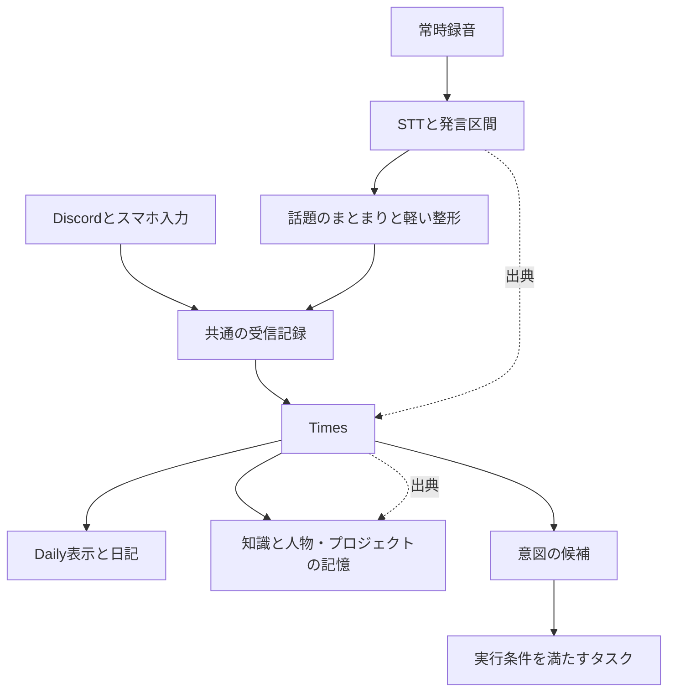

# Life OSの保存形式とTimesの再設計

## 1. 結論

Life OSの正本には、構造化したDBと音声などのファイル保管を組み合わせる構成を推奨する。Timesは入力元を問わない生活ログとして残す。Daily・プロジェクトページ・知識ノートは、同じ記録を目的ごとに表示するviewとして再構成する。文章の本文には引き続きMarkdownを使えるが、ファイルの配置や見出しの位置をデータの識別子にはしない。

この判断は「MarkdownはAIに不向きだから」ではない。UI/CLI経由で編集することが前提になり、ファイル直接編集との互換性を維持する必要がなくなったためである。常時音声からの多数の入力、訂正、複数の出典、意図の変化、処理の再試行を扱うには、文書より細かい単位に安定したIDと状態を持たせる方が素直になる。

推奨する初期構成は、中央の単一サービスが書き込みを管理するSQLite、音声・画像・添付のファイル保管、必要な部分だけを返す検索APIである。知識の文章はDB内のMarkdown本文として管理し、必要に応じてObsidian向けにexportする。PostgreSQLへ最初から進む選択も成立するが、複数端末があるという理由だけでは必要にならない。端末はAPIに接続し、DBの同時書き込みは中央サービスで扱える。

これは2026-09-09の[初回調査](life-os-architecture-2026-09-09.md)にあった既存構成の維持を優先する案を、保存モデルについて更新する提案である。repositoryの全面統合や実装の全面書き直しを必須とはしない。データモデルを作り直す判断と、既存コードをどこまで再利用するかの判断は分ける。

## 2. 現状のvaultで問題になるところ

確認したvaultの説明には、Dailyをhubとする方針、KnowledgeのZettelkasten型配置、Projects/Areas、AI専用workspace、添付領域がある。実際の最上位には番号付きの旧領域と、`times/`・`knowledge/`・`threads/`なども存在する。存在だけでは重複した内容があるとは断定できないが、分類体系と新しいアプリのdomainが併存している。

またREADME、AGENTS、CLAUDEのタスク管理先の説明は一致しない。Olympusのarchitectureには、Markdown正本とSQLite索引に加えて、DB内に再構築不能な運用状態もあることが記載されている。つまり既存構成も、実際には「ファイルだけがすべての正本」という単純な状態ではない。これらはローカル文書と型定義の確認であり、本番稼働や全データの監査結果ではない。

| 現在の軸                     | Life OSで生じる問題                            | 再設計での扱い                   |
| ---------------------------- | ---------------------------------------------- | -------------------------------- |
| Dailyという日付の箱          | 複数日にまたがる話題の同一性を別途推定する必要 | 発生日時を属性にして日付別に表示 |
| Knowledgeという完成度の箱    | 未整理の発言から知識へ昇格した根拠が見えにくい | 出典付きの知識documentとして管理 |
| Projects/Areasという対象の箱 | 一つの発言が複数の対象に関係する               | IDによる多対多の関連付け         |
| Archiveという状態の箱        | 移動と状態変更が結び付く                       | statusと有効期間で管理           |
| AIという書き手の箱           | 人間の事実とAIの推測を内容だけで見分けにくい   | originと確認状態を各記録に保持   |
| Markdownの見出しやpath       | renameや再整理で参照が不安定になる             | 安定IDを持ちpathは表示・export用 |

PARA的なProjects/Areas/Resources/Archiveは閲覧の整理としては使える。しかし、それだけでは「誰がいつ言ったか」「どの記録を訂正したか」「今も有効か」「実行が許されているか」を表現できない。Zettelkastenも、理解を育てる知識層には向いているが、すべてのSTT断片をatomic noteにする理由にはならない。

したがって、最初に決めるべきものは次の四つである。

| 分類         | 決めること                   | 推奨                                  |
| ------------ | ---------------------------- | ------------------------------------- |
| データモデル | 何を独立した記録として扱うか | 発言・Times・知識・意図・タスクを分離 |
| 保存基盤     | 何が正本で何を再生成できるか | DBと添付ファイルが正本                |
| 表現形式     | 文章や交換データをどう表すか | Markdown本文と構造化metadata          |
| 索引         | どう必要な根拠へ到達するか   | SQL条件と全文検索を基本に追加検索     |

## 3. 公開されている前例

### Omi：常時音声に最も近い保存モデル

Omiの公式backend文書は、会話を保存する主collectionと、そこから抽出した記憶を保存する別collectionを示している。会話にはtranscript segmentと音声参照があり、記憶は元の会話へ関連付けられる。action itemも別の対象として扱われる。[^1]

取り入れたいのは「会話の記録」「抽出された理解」「行動」を分ける点である。Firestoreなどの標準構成をそのまま採用する必要はない。今回なら会話の後にTimesという人間向けの整理層を置く。この文書だけで日本語の常時記録品質や実運用の取りこぼし率までは分からない。

### Andrej KarpathyのLLM Wiki：知識層の実例

Karpathyは2026年4月の本人の公開文書で、原資料を保持し、LLMが相互リンクされたMarkdown wikiを更新し、自分はObsidianで読む運用を紹介している。資料の取り込み時に知識を統合し、質問のたびに同じ統合作業を繰り返す負担を減らす考え方である。本人の運用は資料を一つずつ確認しながら取り込む形でもある。[^2]

これはKnowledge層の有力な参考になる。ただし、選んだ資料の取り込みと常時音声の処理は入力密度も誤認識率も異なる。生の発言をすべてwikiへ直接統合すると、訂正や曖昧な独り言まで長期記憶に固定され得る。wikiはTimesと出典の上に構築する。

### Basic Memory：Markdown正本も十分成立する

Basic MemoryはMarkdownを正本にし、DBを検索と関係の索引として使う。ファイル変更を検出して索引を更新する構成が公式に説明されている。[^3]

したがって「AI向けだからDBへ移す」という一般論は成り立たない。人がファイルを直接編集したい場合にはこちらが有力である。今回のDB推奨は編集条件と状態管理要件によるものであり、Markdownの検索能力そのものへの否定ではない。

### OpenClaw：記憶を用途ごとに分ける

現在の公式設計では、常時参照する小さな中核記憶、必要時だけ検索する日次記録・transcript、将来の条件で発火するintentが区別されている。ファイルとSQLiteを組み合わせ、出典や更新関係のmetadataを扱う。[^4]

ここからは、生活ログ全体を毎回promptへ入れず、現在の意図と必要な出来事を分けて取り出す構造を参考にできる。特定製品の自律処理や実行方式を採用する提案ではない。

### Capacities：日付は複数対象を見る軸になる

CapacitiesのDay viewには、その日に作成された内容や日付との関連が表示される。Daily note自体は別に存在し、日付を持つobjectの表示と組み合わされている。[^5]

参考になるのは、日付のページにすべてを書き込まなくても、一日の情報をまとめて見られる点である。Life OSではさらに、Timesとタスクと出来事を日付でまとめ、日記はその上で作る文章として分離できる。

### MyLifeBits：個人情報をDBで扱う歴史的な前例

Microsoft ResearchのMyLifeBitsは、2001年からSQLによる個人情報の保存を探索し、2006年の論文で文書・写真・通話・部屋の会話などを含む取り組みを報告している。[^6] 生活の記録をDBに集約する発想自体は新しくない。現在の差分は、その記録から意図を理解して作業につなぐ部分にある。

以上は設計や本人の運用が公開された事例であり、一般ユーザーの採用率を示す調査ではない。全機能が揃った完成品が一つあるという結論にもならない。Omiから記録の分離、LLM Wikiから知識の育て方、Capacitiesから閲覧モデルを取り入れる組み合わせが近い。

## 4. 保存方式の比較

| 方式                                    | 強い点                           | 今回の負担                                   | 判断                       |
| --------------------------------------- | -------------------------------- | -------------------------------------------- | -------------------------- |
| 現在のDaily Markdownを中心に拡張        | 移行が小さい                     | 日次ファイルの更新と部分参照と処理状態が複雑 | 最終形には推奨しない       |
| 一記録一Markdown＋索引DB                | 直接編集と持ち出しが容易         | 多数の更新と出典関係とDB同期を管理           | 直接編集が重要なら有力     |
| DBに生活ログ＋KnowledgeだけMarkdown正本 | 文書編集と構造化記録を両立       | 正本が二系統になり訂正・backup境界が増える   | Obsidian編集を残すなら有力 |
| DB正本＋添付ファイル＋Markdown export   | 状態・関係・訂正を一貫して扱える | UI/CLIとexport・復元を用意する必要           | 今回の推奨                 |
| JSONLを全記録の正本にする               | 追記と交換が単純                 | 現在状態と削除と関係検索の再構築が必要       | exportや受信保管に限定     |
| Vector DBを正本にする                   | 類似した文章を取得しやすい       | 正確な状態変更や出典の整合性を別途管理       | 検索の派生層に限定         |
| Graph DBを中心にする                    | 関係探索を表現しやすい           | entity抽出と誤関係修正と追加運用が必要       | 初期の必須要件にしない     |

DB中心でも、文書本文まで細かいJSONに分解する必要はない。研究レポートや説明はMarkdown本文で持ち、ID・出典・更新日時・対象・確認状態を構造化する。逆にtaskの状態や実行結果を自由文だけにしてLLMに毎回読ませることは避ける。

SQLiteは単一時点のwriterが一つになるが、短い書き込みを順番に処理する設計では適合する。多数のwriterが同時に待たずに書く必要が出た場合はclient/server DBの理由になる。SQLiteの公式指針もこの違いを説明している。[^7] STTやLLM推論中にDB transactionを保持せず、結果を保存する短い区間だけで更新する前提で選ぶ。

PostgreSQLを最初から選ぶ条件は、独立した複数サービスが並行して更新する設計を採用する場合や、DBを別マシンで運用する必要がある場合である。RAM 16GBだけを理由に排除しない。一方で初期の個人用単一サーバーに、DB・queue・graph・vectorを別々の常駐サービスとして並べる必然性もない。

## 5. 常時録音をTimesへ流す設計

Timesを、Discord投稿を保存する機能から、生活で起きたことや考えたことを読み返す共通のfeedへ広げる。Discord・音声・スマホは入力adapterであり、Timesの保存形式を各adapterに決めさせない。



入力の原本保存は整形より先に行う。図の共通受信記録は、音声では発言区間への参照と整形結果、Discordでは投稿の原文とsource IDを受け取る。通信の再送と内容の似た別発言を混同しない。

「ノイズを消す」は三段階に分ける必要がある。

| 段階           | 対象                     | Timesへの影響                            |
| -------------- | ------------------------ | ---------------------------------------- |
| 音響的な除去   | 音楽・環境音・エコー     | STT前の処理。詳細はHome Assistant側      |
| 表記の整形     | 言い淀み・重複・句読点   | 意味を変えずに読みやすくする             |
| 意味による選別 | 残す話題と隠す話題の判断 | 記憶の取りこぼしを生むため別policyにする |

採用方針は、本人の意味のある発言を軽く整形し、話題のまとまり単位でTimesにすること。すべてを重要事項の要約に置き換える案は採らない。「昼に何を食べたか」のような日常的な事実も、後から質問の対象になり得る。重要度は表示や長期記憶への昇格に使い、原本の即時破棄とは分ける。原音声をどれだけ残すかは別の保持設定である。

説明用の架空例として、発言が「机を直したい。来月でいい。今日は触らないで」だった場合、Timesは「机を来月直したい。今日は作業しない」とできる。意図は保留中として記録し、今日の修理taskを自動生成して着手しない。否定・時期・条件は、整形時にも落としてはいけない。

「さっきの机の話だけど」と続いた発言は、既存のTimesや同じprojectに関連付ける。昨日の記録を消して書き換えるだけではなく、意図の変更として追えるようにする。毎回LLMへ全履歴を渡す必要はなく、最近の話題と候補の参照を検索して扱える。

一つのTimesが複数の音声区間を参照し、一つの会話から複数のTimesができることを認める。STTの10秒chunkなどの機械的な分割と、人間が読む一投稿の単位は一致させない。長い話では暫定表示から確定へ更新できるようにし、一定時間すべてを待つことも避ける。

なお「既存のTimes」がDiscord channelそのものを指す場合、音声から生成した内容をDiscordへ送る出口も必要になる。Life OS内のTimes feedを指す場合には不要である。どちらでも内部の記録モデルは共通にできるが、外部送信の対象は異なるため実装前に決める。

## 6. 最小限必要な記録の種類

以下は概念設計であり、すべてを個別のserviceやtableにする指定ではない。

| 記録               | 保持するもの                              | 必要な理由                   |
| ------------------ | ----------------------------------------- | ---------------------------- |
| Source             | 入力元・元のID・発生時刻・受信時刻・話者  | 再送と重複の識別             |
| Media / Segment    | ファイル参照・音声区間・STT本文・revision | 元の発言へ戻る               |
| Times entry        | 整形本文・表示日時・複数のsource参照      | 日常のfeed                   |
| Entity             | 人物・project・場所・道具などの安定ID     | 同じ対象を継続して追う       |
| Claim / Preference | 観測・好み・出典・有効期間・確認状態      | 現在の理解と過去の理解を区別 |
| Intent             | やりたいこと・条件・保留理由・変更履歴    | 未着手の考えを失わない       |
| Task / Run         | 実行可能な仕事・状態・成果・外部実行ID    | 意図と実行を分離             |
| Document           | 日記・調査・設計・知識本文とrevision      | 読める成果を蓄積             |

SourceとAIの加工結果を区別し、加工には入力revisionと処理versionを残す。LLMの確信度が高いことと本人が確認したことは別の属性にする。会話の中の引用や推測も、本人の確定した希望へ自動的に昇格させない。

「現在の住所」「以前の住所」のような時間的な変更には、有効期間と記録した時刻の違いがある。最初からすべての属性を複雑な時間DBにする必要はないが、更新で昔の事実を消す設計は避ける。Graphitiは時間とともに変わる関係を扱う公開実装の参考になる。ただし、そのためだけに専用Graph DBを最初から導入する必要はない。[^8]

汎用のobject一種類と無制限のJSON属性だけにすると、task状態や出典の制約を検証しづらい。coreの種類は明示し、入力元固有のpayloadや追加metadataにJSONを使う程度から始める。

## 7. 整合性・訂正・復元

DBへ移せば自動的に正しくなるわけではない。受信記録とTimesの作成と処理予定の登録を、可能な範囲で一つのtransactionとして扱う設計が必要になる。workerは保存済みの処理予定を取り出し、結果を再試行可能な形で保存する。外部APIへの実行はDB transactionの外なので、外部operation IDや結果照合を別途扱う。

全面的なevent sourcingは初期には不要である。現在状態、変更履歴、処理予定をDBに持つ構成で始められる。音声ファイルはDBと同時にはcommitできないため、保存完了の確認と参照登録の順序、残った未参照ファイルの回収も必要になる。

訂正は、その記録から作った知識や要約に伝播しなければならない。具体的には出典のrevisionが変わった派生物を古いものとして識別し、影響するものだけ再生成する。毎晩すべてのwikiを書き直す方式にはしない。人が追記した日記本文とAIの生成部分もrevision上で区別する。

原本は保持期間内で根拠として保全するという意味であり、永久保存を要求するものではない。削除対象を音声だけにするのか、文字起こしやTimesや派生記憶まで含めるのかを区別する。削除や訂正後に古い要約から同じ事実を再抽出して復活させないことも、関係を保持する理由になる。

移行可能性はMarkdown exportだけでは足りない。人間向けのMarkdownに加えて、ID・関連・revision・実行状態を含むJSONLなどの構造化export、添付ファイル、schema version付きmanifestを用意する。DBと添付の整合したsnapshotから復元できることが必要であり、exportがあるだけではbackupの代わりにはならない。

## 8. 人間とagentに見せる構成

人間には、保存方式を見せるより目的別の画面を用意する。

| View      | 表示内容                            |
| --------- | ----------------------------------- |
| Times     | 音声や投稿から整理した生活の流れ    |
| Today     | 今日のTimes・予定・進行中の仕事     |
| Intent    | いつか実現したいこと・保留中の考え  |
| Projects  | 目標・関連Times・決定・タスク・成果 |
| Knowledge | 出典を辿れる整理済みの知識          |
| Review    | 訂正候補・相反する情報・日記生成    |

同じ発言がTodayとProjectsに表示されても、保存するのは同じIDの記録である。Dailyの日付をまたいでもprojectへの関連は維持される。日記はこれらを読む一つの文章であり、すべてのデータを戻すための中間ファイルにはしない。

ファイルとして持ち出したい場合は、たとえば次のexportを提供できる。これは稼働中の正本を並べたディレクトリではない。

```text
export/
  manifest.json
  records.jsonl
  daily/
  projects/
  knowledge/
  attachments/
```

agentにもDBを丸ごと渡さない。期間・対象・状態で検索し、短い候補一覧から必要な詳細と出典を取得する入口を提供する。「机について今の希望」と「机について以前に何と言ったか」は、現在の意図と発言履歴という別の取得である。

DB内に保存しても返却本文は短いMarkdownでよい。逆にMarkdown保存でも、毎回ディレクトリ一覧や全文を読む設計ならtokenを使う。token効率を決める主要因は、必要な情報を先に絞れるか、整理結果を再利用できるか、古い情報を除外できるかである。

## 9. 検索とLLM費用

検索は最初からVector DB一択にしない。日時・project・人・状態のSQL条件と全文検索を基本とし、言い換えで取り逃す質問にembedding検索を足す。関係を何段も辿る質問が実際に多い場合にgraphを評価する。コードの探索はindexionなど既存のrepo索引との連携対象であり、生活記録と同じ索引へ全文コピーする必要はない。

SQLite FTS5にはtrigram tokenizerもあるが、3文字未満の検索などに制約がある。日本語の短語や表記揺れを含めた評価が必要であり、FTSを有効にしただけで日本語検索が十分になるとはしない。[^9]

静的に処理できるものは、source IDの重複排除、日時変換、状態遷移、出典の整合性確認、期間filter、表示、再試行である。話題分割、文脈を保った整形、意味の近い候補の統合、矛盾の解釈にはLLMが役立つ。STTやVADも推論処理であり、単純な文字列処理と同じ費用とみなさない。

LLMへ渡す単位は音声packetではなく話題のまとまりにする。ただし長時間の完了待ちは会話体験を損ねるため、リアルタイム応答とbackgroundのTimes整理を分ける。頻繁に参照するproject要約や現在の意図は増分更新し、質問のたびに数か月分を読み直さない。

事前整理には費用がかかる。ほとんど再利用しない内容まで多段要約すると、単純な検索方式より総費用が増え得る。「DB化すればtokenが何割減る」とは現時点では言えない。入力処理、記憶整理、検索、応答の四区分で費用を測るべきである。

## 10. システムとrepositoryの境界

データの保存方式を統合することと、すべてのシステムを同じrepositoryへ入れることは独立である。最初は少数のprocessと一つの生活データDBで運用し、code上のmodule境界を明確にする程度でよい。

| 所有者                       | 責務                                  |
| ---------------------------- | ------------------------------------- |
| Life OS core                 | Times・記憶・意図・生活上のtaskと検索 |
| Home Assistant / 音声runtime | 音響処理・会話入出力・media・家電状態 |
| Discord / Mobile adapter     | 入力の変換と表示・通知                |
| Coding runner / Orca         | 開発workspace・実行session・成果物    |
| dotfiles                     | ツールと環境の配布                    |
| 各project repository         | ソースコードとproject固有の設計       |

Life OSは開発jobの依頼・状態・成果への参照を持ち、repositoryの全内容を生活DBへ複製しない。家電状態の正本もHome Assistant側に残す。OlympusをLife OS coreの実装場所にするのは自然だが、既存のMarkdown正本という制約まで維持する必要はない。

既存Olympusの`TimesPost`型にはID・本文・時刻・client・audio参照・task/session/knowledgeとの関連がある。一方でこの型には複数音声区間のsource参照や整形revisionは表現されていない。既存の画面やAPI概念は再利用候補になるが、単一の`audio_id`追加だけで常時記録のモデルが完成するとは扱わない。

## 11. 作り替える場合の順序と受入基準

最初に保存形式の移行から始めるのではなく、代表的な体験を固定する。「昨日の続き」「後でやりたい」「それは取り消し」「さっき何と言った」「調査結果を残す」が、同じ出典を辿って動くことを基準にする。

1. Source・Times・Intent・Task・Documentの境界とIDを決める
2. 架空の音声文字起こしとDiscord入力で訂正・重複・関連付けを検証する
3. 既存の保存先を棚卸しして一つのimport経路を設計する
4. 小さなコピーで検索とexport・復元を比較する
5. 同じ質問集合で現在のvault方式とDB案の品質・費用を測る
6. 移行する場合だけ書き込み先を切り替える

切り替え時に複数の正本へ書き続ける構成は避ける。旧ファイルは移行元として保持し、新側から旧形式へexportする方向を基本にする。何を引き継げなかったかも記録し、ID数の一致だけで成功とは判定しない。

| 検証項目 | 受入基準の例                                     |
| -------- | ------------------------------------------------ |
| 再送     | 同じsource IDの再送でTimesが増えない             |
| 別発言   | 同じ文面を別日に言った記録は失わない             |
| 意図     | 否定と保留と条件を維持する                       |
| 出典     | 回答から元投稿や音声区間を開ける                 |
| 訂正     | 訂正済みの内容を現在の事実として返さない         |
| 横断検索 | 別名と日本語短語でも必要な記録に到達する         |
| 復元     | exportまたはbackupから関連と実行状態を復元する   |
| 費用     | 同じ質問品質で入力から応答までの総費用を比較する |

## 12. 残る設計質問

保存モデルの方向は以下の回答を待たずに決められる。回答によってTimesの見せ方と記憶の昇格条件が変わる。

- Timesへの音声入力は軽い整形か重要部分の選別か会話単位の要約か
- Timesの閲覧先はLife OS内のfeedか既存Discord channelか両方か
- 記録対象は本人の独り言だけか相手との会話も含むか
- 原音声と文字起こしをそれぞれどの期間まで遡りたいか
- 自動生成されたTimesを本人の投稿と同じ一覧に混ぜるか
- よく使う質問は過去の再現か現在の希望の確認か将来の実行か
- 未確定の意図を週次などでまとめて提示する必要があるか
- 「記憶する」「調査する」「開発する」を自動化する条件は何か
- 誤った記憶の訂正は元発言の修正か現時点の補足か両方を扱うか
- cloudへ送らない情報を原音声・transcript・検索結果の各段階でどう決めるか

## 出典と確認範囲

公開資料は2026-09-14に確認した。公式設計の記述は採用実績や性能保証とは区別する。日本語音声性能、検索benchmark、token削減率、実サーバーの負荷は未測定である。本文のschema・境界・移行案はこれらの資料と現状条件から導いた設計提案である。

ローカル根拠はvaultの`AGENTS.md`・`CLAUDE.md`・`README.md`・最上位構成、Olympusの`docs/architecture.md`と`packages/core/src/types/times.ts`、初回調査に記録したintake・writer調査である。privateな日記本文を網羅的に読み出したものではない。

[^1]: Omi, [Storing Conversations & Memories](https://docs.omi.me/doc/developer/backend/StoringConversations). 更新日記載なし。会話と派生記憶と出典の構造。

[^2]: Andrej Karpathy, [LLM Wiki](https://gist.github.com/karpathy/442a6bf555914893e9891c11519de94f), 2026-04-04. 本人の知識管理パターンと運用の記述。

[^3]: Basic Memory, [Technical Information](https://docs.basicmemory.com/reference/technical-information). 更新日記載なし。Markdown正本とDB索引。

[^4]: OpenClaw, [Memory architecture](https://docs.openclaw.ai/concepts/memory-architecture). 更新日記載なし。記憶の階層とprovenance。

[^5]: Capacities, [Dates and daily notes](https://docs.capacities.io/reference/dates-and-daily-notes). 更新日記載なし。日付によるobject表示とDaily note。

[^6]: Jim Gemmell, Gordon Bell, Roger Lueder, [MyLifeBits: a personal database for everything](https://www.microsoft.com/en-us/research/publication/mylifebits-a-personal-database-for-everything/), Communications of the ACM, 49, 88–95, 2006-01. SQLによる個人記録の歴史的研究。

[^7]: SQLite, [Appropriate Uses For SQLite](https://www.sqlite.org/whentouse.html). 単一writerとclient/server DBを選ぶ条件。

[^8]: Zep, [Graphiti](https://github.com/getzep/graphiti). 継続的に変わる情報と関係を扱う実装。

[^9]: SQLite, [FTS5 Extension](https://www.sqlite.org/fts5.html). 全文検索とtrigram tokenizerの制約。
